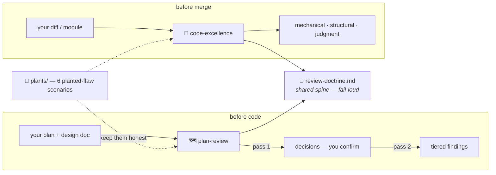

<div align="center">

# 🔍 review-toolkit

**Two Claude Code subagents that review plans and code against *your* project's documents — plus the test suite that keeps them honest.**

[](VERIFICATION.md)
[](../../releases)
[](#-whats-inside)
[](#-whats-inside)
[](LICENSE)

[What's inside](#-whats-inside) •
[How it works](#-how-it-works) •
[Install](#-install) •
[Verify](#-verify-before-you-trust) •
[Limitations](#%EF%B8%8F-known-limitations-disclosed-on-purpose)

</div>

---

## 📦 What's inside

| Piece | What it does |
|---|---|
| 🗺️ **`plan-review`** | Two-pass plan reviewer. Pass 1 extracts the decisions the plan claims to rest on and makes **you** confirm them. Pass 2 reconciles those decisions against your design doc, then grills the plan in three tiers. A decision that contradicts the doc is a **BLOCKING** halt — the reviewer never silently picks a winner; that call is yours. |
| 🧐 **`code-excellence`** | Three-layer code reviewer: **mechanical** (discovers and runs the project's *own* declared lint/test gates — never eyeballs what a tool catches better), **structural** (your project's stated rules: layering, boundaries, security at inputs), and **judgment** (Ousterhout-style depth: does a docstring promise something no test enforces?). Read-only: it names issues and remedies, edits nothing. |
| 📜 **`review-doctrine.md`** | The shared spine both agents load as their first action — and halt loudly without. Tier discipline, seven default architecture rules, test-review rules (every test must be able to go red — and you must name the mutation that reddens it), plan-chunking + evidence-design rules, finding-quality ordering, and the rule that *"nothing to cut" is a valid answer* — a reviewer forced to always produce findings is a reviewer that invents them. |
| 🌱 **`plants/`** | The test suite. The agents are prompts; no compiler or pytest guards a prompt. Six planted-flaw scenarios with known answers are the only mechanism that makes "the reviewers work" a **checkable claim** instead of prose. See [VERIFICATION.md](VERIFICATION.md) for the exact run protocol. |

## ⚙️ How it works



### Why subagents, not a skill file

A subagent runs in a **fresh context**. That's not an implementation detail — it's the core mechanism. This toolkit was distilled from a real project whose recurring failure was: *the finding doesn't transfer to the finder*. The same model that writes "every claim needs an enforcing mechanism" ships, in the same commit, a claim with no mechanism — because knowing ≠ applying, inside one context. A reviewer with fresh eyes applies the doctrine from outside the head that produced the work. Same model, different context, different result.

## 🧬 Origin

Extracted from a production Slack-bot project where every bug of an entire phase had the same shape: **a claim not backed by a mechanism.**

> A spec section cited fourteen times for a rule it never contained.
> A docstring arguing a requirement no test guarded.
> A "verified" feature whose output died at a logger before any handler — every test green, feature dead in prod.

The doctrine's rules, the tier system, and the plant suite are each a direct answer to a bug that actually shipped (or nearly did). Nothing here is theoretical.

The plants exist because the toolkit must obey its own rule: "the reviewers catch real flaws" is a claim, and the planted-flaw suite is its mechanism. Corollary learned the hard way — **a green check is a claim too**: several plants specifically verify *why* something passed, not just that it did.

## 🚀 Install

Two pieces **must** live in `~/.claude` (Claude Code discovers user-level subagents in `~/.claude/agents/`, and both agents load the doctrine from that fixed path):

```bash
cp review-doctrine.md ~/.claude/review-doctrine.md
cp agents/plan-review.md agents/code-excellence.md ~/.claude/agents/
```

**The plants are a testing bed — run them in an isolated folder.** They're plain files read from the session's working directory, so *agents install, plants travel* — but travel them into a **clean, dedicated directory** (e.g. `~/Desktop/plant-lab`), never the repo root, `~/.claude`, or any folder that also holds other projects' draft or temp plan files:

```bash
cp -R plants ~/Desktop/plant-lab            # the plant kit ONLY — no agents, no doctrine, no docs
cd ~/Desktop/plant-lab && pip install ruff && claude   # then follow VERIFICATION.md
```

**Why the isolated folder is not optional.** The reviewer resolves plan/doc paths against the working directory. Launch from a shared root and it will pick up stray planning files left there by *other* projects — reviewing a plan you never meant to test. That's a plant that passes or fails for the wrong reason and can't be reproduced. A folder holding nothing but the plant kit makes every prompt in [VERIFICATION.md](VERIFICATION.md) resolve to exactly the file it names, every time. Copy **only** `plants/` here; the agents and doctrine already live in `~/.claude` (above).

## ✅ Verify before you trust

Run the six plants per [VERIFICATION.md](VERIFICATION.md) — exact prompts, in sequence, with PASS/FAIL criteria and a results log. One green run at default temperature is evidence, not proof; record date, model, and *why* each plant passed.

## 🔒 Change control

> **Editing the doctrine or either agent requires re-running the affected plants before the edit counts as done.**

The edit → re-plant map is at the bottom of [VERIFICATION.md](VERIFICATION.md) and [plants/RUNBOOK.md](plants/RUNBOOK.md). An unverified edit silently un-verifies the whole toolkit — the "verified" label belongs to a version, not a name.

## ⚠️ Known limitations (disclosed on purpose)

- ~~**Layer 1 is Python-hardcoded.**~~ **Closed 2026-07-23.** Layer 1 now discovers the project's own gates from its manifests (CLAUDE.md / pyproject / package.json / Makefile) and runs the declared checker — no assumed tool. Per change control this edit (plus new doctrine sections) owes re-runs of plants **3, 4, 5** — the badge above stays orange until they're logged in [VERIFICATION.md](VERIFICATION.md).
- **Doctrine defaults vs your project's rules.** The seven architecture rules are defaults. Both agents read your project's own docs and stated rules first; the doctrine fills gaps, it doesn't override. A project with no stated rules is itself a flagged finding, not a license to assume.

## 💡 Design decisions worth stealing

- Reviewers **name** issues + remedies; they never edit. *An editor grades its own homework.*
- Tiers encode **epistemic status** (mechanically checkable vs argued judgment), orthogonal to severity. A reader should always know *how* a finding could be wrong.
- **One doctrine file, loaded fail-loud.** Duplicated rules drift — a fix landing in one copy and not the other is how this file came to exist.

---

<div align="center">
<sub>Built for <a href="https://claude.com/claude-code">Claude Code</a> · verified per <a href="VERIFICATION.md">VERIFICATION.md</a> before every release</sub>
</div>
