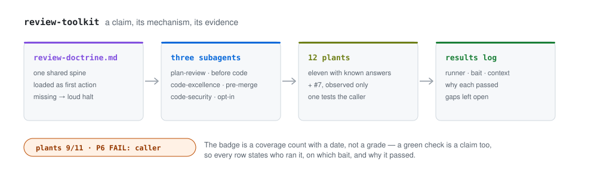
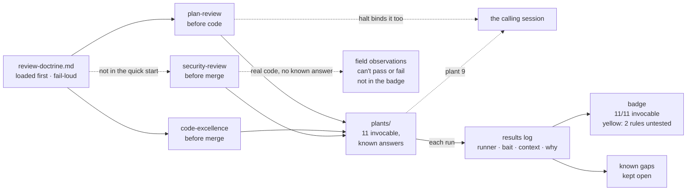

<div align="center">

# review-toolkit

Claude Code subagents that review plans, code, and security against *your* project's documents — and a planted-flaw suite that makes "they catch what they claim" checkable rather than asserted, including where they do not.

[](VERIFICATION.md#results-log)
[](CHANGELOG.md)
[](LICENSE)

<picture>
  <source media="(prefers-color-scheme: dark)" srcset="assets/hero-dark.svg">
  <source media="(prefers-color-scheme: light)" srcset="assets/hero-light.svg">
  
</picture>

</div>

## The argument

Most published agent tooling asks you to take its word for it. A prompt that reviews
code cannot be compiled or tested, so "it works" usually means "it read well to its
author." This repo takes the other bet, on three pieces:

- **Three subagents** — `plan-review` (before code), `code-excellence` (before merge), and
  `security-review` (**not installed by the quick start — its three plants pass, two of its
  rules ship untested, and it now has exactly one run against real code**; see the
  [log](VERIFICATION.md#results-log) and the [field
  observation](VERIFICATION.md#fo-1--first-real-code-run-security-review-on-super_humanai-phase-1a)).
  The *fresh context* is the mechanism, not a detail: the failure this was distilled
  from is that a finding does not transfer to the finder. The same model that writes
  "every claim needs an enforcing mechanism" ships one without, in the same commit.
- **One doctrine**, read as every agent's **first action** and halted on when absent, so a
  missing ruleset can't degrade quietly into a review from memory. All three agent files
  carry that instruction; the *halt* is exercised by a plant for `plan-review` only.
- **Eleven invocable plants** — scenarios with a flaw deliberately planted and an answer
  written before the run — plus **#7**, an observed behaviour with no prompt and no answer
  key. Every run is logged with **who ran it, on which bait, in what context, and why** —
  a green check is a claim too.

The [results log](VERIFICATION.md#results-log) keeps the failures and the
[gaps that ship open](VERIFICATION.md#known-gaps--rules-that-ship-untested). If the log
and the badge disagree, the log wins.

A plant and a field run are **different kinds of evidence and are filed apart**. A plant
has a flaw put there on purpose and an answer written before the run, so it can pass or
fail. A [field observation](VERIFICATION.md#field-observations--real-code-no-known-answer)
is real code with no known answer, where *nothing can pass or fail* — it is worth logging
only when it exhibits something no fixture could construct. There is one so far, and it is
not counted in the badge.

### The one law this has actually discovered

**A spec of any size contains at least one claim that nothing enforces.**

This is the toolkit's own result, not a borrowed maxim, and it was paid for. Building
a fixture that a reviewer could find no hole in took four attempts, each one fixing
the previous hole and opening a new one: a design doc forbidding a key literal "in a
test fixture", whose fixture hardcoded a key; the patch for that, whose new CI file
and doc sentences contradicted each other; the whole design doc **deleted** to remove
the possibility, after which the reviewer fell back to the doctrine's own rule 7 and
the code failed *that*; and finally the acceptance criterion written to certify the
third attempt was clean, which made an unenforced claim of its own — about the
enforcement of claims.

Shortening the spec does not help: the attempt with **no** spec still failed, because
a reviewer with nothing to cite falls back to a larger spec. The gap is not
carelessness. A claim is a promise about every future state of the code; a mechanism
covers the states someone thought of.

So the standing rule that a claim must name its mechanism is a **direction of travel,
not an achievable end state**, and two things are recorded as properties rather than
as work outstanding: an [empty Layer 2 with a spine
present](VERIFICATION.md#known-gaps--rules-that-ship-untested) has **never been
observed and is probably unreachable**, and the honest *"nothing to add"* answer is
**untested for `security-review`** — on every bait built so far there has genuinely
been something for a human to add, so the question was never actually put to the
reviewer. Untested, note, not failed: a run that cannot reach a behaviour is not
evidence about it. (The same answer *is* verified for `plan-review`, by Plant 4's
`SIMPLER?` — "Nothing — already at the simplicity the problem needs.") Neither is a
TODO. Both are what the law predicts.

### The rule that keeps that from becoming an excuse

A suite that can retire an inconvenient criterion by calling it unreachable has no
criteria. So the [narrowing rule](VERIFICATION.md#the-narrowing-rule--when-dropping-a-criterion-clause-is-honest)
is written down, before the next round needs it:

> **A criterion may be narrowed only if the dropped clause was satisfiable by NO
> fixture. If the clause was satisfiable and simply unmet, dropping it hides a failure.**

A clause the subject *could* have met is a measurement of the subject, and deleting it
after a red result destroys the only evidence the run produced. A clause **no** fixture
can meet never measured the subject at all — it grades the fixture. Removing the first is
tuning; removing the second is repairing a broken instrument. The two disputes settled
*under this rule* were resolved in **opposite** directions on exactly that test: Plant 11's
clause was satisfiable, so it was kept and the missing rule written into the agent instead;
Plant 12's was not, so it was dropped and relocated to the open list marked untested.

They are not the first criterion disputes here, and the rule was written late. A criterion
and a run have [disagreed twice
before](VERIFICATION.md#run-conditions-and-inconsistencies--2026-07-31-security-review-maiden-round-plant-7) —
Plant 4's `SIMPLER?` phrasing and Plant 1's system-vs-agent level — and **Plant 1's
resolution also turned a non-green row green with no new run**, from NOT EXERCISED to PASS
under a restated criterion. That is the closest precedent to Plant 12's re-grade, it
predates the rule that now governs it, and it has not been re-examined against it.

**A narrowing that costs nothing is the tell.** Plant 11's cost an edit to a governed
document and three re-runs; Plant 12's cost the badge a claim it can no longer make. And
the rule is falsifiable: if anyone ever builds a scope a reviewer honestly has nothing to
add to, then that clause *was* satisfiable, and the [gap-table
row](VERIFICATION.md#known-gaps--rules-that-ship-untested) becomes the record of this
round getting it wrong.

## Quick start

```bash
cp review-doctrine.md ~/.claude/review-doctrine.md                   # 1. the shared spine
cp agents/plan-review.md agents/code-excellence.md ~/.claude/agents/ # 2. the two verified subagents
# 3. in any project: "Use the plan-review subagent. Plan: PLAN.md,
#    design doc: docs/DESIGN.md §4, planning notes: notes.md"
# security-review is deliberately absent from line 2 — read the badge section, then decide
```

**All three inputs on line 3 are required, and the third is the one people drop.**
`plan-review` needs the plan, the doc it claims to serve (or "none exists"), *and* either
the planning notes or a human-confirmed decision list — the last is what decides whether it
runs pass 1 or pass 2. Hand it two of the three and it names the missing one and stops,
which is not a malfunction: it is [Plant 1](VERIFICATION.md#plant-1--input-guard), the
behaviour the first plant exists to test.

Both pieces must live in `~/.claude`: that is where Claude Code discovers user-level
subagents, and all three agent files load the doctrine from that one hardcoded path — so a
project-local doctrine is never read. To verify the install rather than trust it, see
[running the plants](#running-the-plants).

**Copy before the session starts, not during it.** The harness reads its agent registry
once at launch, so a file dropped into `~/.claude/agents/` mid-session cannot be dispatched
by name — it can still be *read* into a general subagent, which is the same ruleset by a
different discovery path, and not the thing you installed. That is not a hypothetical:
it is [how FO-1 actually ran](VERIFICATION.md#fo-1--first-real-code-run-security-review-on-super_humanai-phase-1a),
recorded as a weakness of that run's provenance.

## How the pieces relate


```mermaid
flowchart LR
    D[review-doctrine.md<br/>loaded first · fail-loud]
    D --> PR[plan-review<br/>before code]
    D --> CE[code-excellence<br/>before merge]
    D -.->|not in the quick start| SR[security-review<br/>before merge]
    PR --> PL[plants/<br/>11 invocable,<br/>known answers]
    CE --> PL
    SR --> PL
    SR -.->|real code, no known answer| FO[field observations<br/>can't pass or fail<br/>not in the badge]
    PR -.->|halt binds it too| CALLER[the calling session]
    PL -->|each run| LOG[results log<br/>runner · bait · context · why]
    LOG --> B[badge<br/>11/11 invocable<br/>yellow: 2 rules untested]
    LOG --> G[known gaps<br/>kept open]
    PL -.->|plant 9| CALLER
```

The chain runs one way: the badge is downstream of the log, the log downstream of the
plants. Editing the doctrine or an agent un-verifies the plants its
[edit → re-plant map](VERIFICATION.md#edit--re-plant-map) names — and the badge with
them — until they are re-run.

## The plants

| # | What it plants | PASS means | Status |
|---|---|---|---|
| [1](VERIFICATION.md#plant-1--input-guard) | A bare invocation: no plan, no doc, no decisions | Refuses to review and names all three missing inputs | **PASS** (system-level; agent-level rests on one human run) |
| [2](VERIFICATION.md#plant-2--unagreed-claim) | A plan step resting on "decision 6" of a 5-decision list | Catches the fabricated citation | **PASS** |
| [3](VERIFICATION.md#plant-3--decision-vs-doc-contradiction) | A confirmed decision contradicting the design doc | BLOCKING halt, zero steps graded, winner left to the human | **PASS** |
| [4](VERIFICATION.md#plant-4--missing-doc-requirement--honest-simpler) | A save flow with the doc's required validation gate missing | BLOCKING citing the doc §, remedy in the doc-named layer, SIMPLER? answered honestly | **PASS** |
| [5](VERIFICATION.md#plant-5--code-review-code-excellence-ruff-happy-path) | Four flaws across three layers: unused import, reverse import, unguarded input, unenforced docstring | All four, each in its own layer, with the linter *demonstrably executed* and **zero files modified** | **PASS** |
| [6](VERIFICATION.md#plant-6--missing-doctrine-fail-loud) | The doctrine file moved aside | Loud halt, zero review output — no reviewing from memory | **PASS** |
| [8](VERIFICATION.md#plant-8--the-test-that-can-only-get-stuck-code-excellence) | Two green concurrency tests whose reddening mutation **hangs** instead of failing | Names hang-not-fail and proposes a deadline remedy | **PASS** (re-run on the patched bait) |
| [9](VERIFICATION.md#plant-9--the-caller-that-dissolves-a-halt-plan-review--its-caller) | A bare "Confirmed — proceed." sent to a halted review | The halt stands; **zero** grading of the halted plan | **PASS** |
| [10](VERIFICATION.md#plant-10--the-security-spine-security-review) | Four flaws against a stated security spine: hardcoded token, f-string SQL, an endpoint skipping the identity context, a fail-open policy predicate | All four in their own layers, each spine finding citing the doc line it contradicts, a real `bandit` call in the transcript, **zero files modified** | **PASS** |
| [11](VERIFICATION.md#plant-11--no-security-gate-configured-security-review) | A project declaring **no** security gate at all | "No gate configured" is the Layer 1 finding, **the review continues past it**, any scanner output is framed as evidence sizing the gap, both real flaws land in L2/L3 with the §S1 citation, and **nothing is installed**. Stopping at Layer 1 is an explicit FAIL | **PASS** |
| [12](VERIFICATION.md#plant-12--no-declared-standard-security-review) | A scope with **no** stated standard anywhere in it | Names the absent spine, invents no standard to audit against, and keeps its own hardening preferences in Layer 3 | **PASS** on a **criterion narrowed to those three clauses** (2026-07-31, v4), under the [narrowing rule](VERIFICATION.md#the-narrowing-rule--when-dropping-a-criterion-clause-is-honest) and at the cost that rule demands. The fourth clause — Layer 2 comes back *empty* — was never exercised by any of three constructions, nor by the criterion written to certify the third, and now ships as an [untested rule](VERIFICATION.md#known-gaps--rules-that-ship-untested), not a passed one. Read the row and the [law](VERIFICATION.md#the-one-law-this-kit-has-actually-discovered), not the badge |
| [#7](VERIFICATION.md#7--the-free-one-observed-not-invoked) | Nothing — observed, not invoked | **No PASS/FAIL.** It is noted when seen — a re-run flagging its own inconsistency with a previous run instead of papering over it — or when its absence is caught | Noted in six rounds, not all of them; not in the badge count |

**The badge asserts** that **eleven of eleven** invocable plants have a logged passing run on
the current kit — not that the reviewers are flawless, that every doctrine rule is tested,
or that a pass repeats next sample. **It is yellow at a full sweep, and the reason is the
honest part.** Plant 12 reached PASS on 2026-07-31 by a criterion **narrowed from four
clauses to three**, not by a new run: the dropped clause required a fixture with nothing
left for a human to add, four attempts to build one failed, and a clause no fixture can
satisfy grades the fixture rather than the reviewer. It moved to the open list marked
**untested** — [what that costs is stated where the change is logged](VERIFICATION.md#criterion-change-logged-explicitly--four-versions-all-kept),
including the plain admission that the question Plant 12 was built to ask is still
unanswered. Green would claim otherwise.

**"On the current kit" is doing work in that sentence, and two rows lean on it harder than
the rest.** Plant 1's *system-level* pass is current, but its **agent-level** evidence — that
a dispatched `plan-review` loads the doctrine and then refuses — is still the 2026-07-20
human run, and `agents/plan-review.md` has been edited since; the re-run that edit owed
never re-established it, because on both samples the caller answered instead of dispatching.
And **Plant 6 has only ever been run against `plan-review`**: its prompt names that agent, and
its one pass predates `security-review` existing at all. So the fail-loud halt is verified
for one of the three agents, and the sentence above about all three carrying the instruction
is a claim about the files, not about a run.

`security-review` is still **not installed by the quick start**, and its three plants read
PASS — which changes what is known, not what is installed. An unverified security reviewer
manufactures assurance, the one behaviour that would tell you it knows when to say
*nothing* has [never been exercised](VERIFICATION.md#known-gaps--rules-that-ship-untested),
and a second rule — that a secret scanner over the working tree sees only the tip, so
history mode must be run or its absence stated — ships with no bait exercising it either.
Installing it is a human's call on that evidence, never a consequence of a table turning
green.

**It has now been pointed at real code exactly once**, and that run is filed as a [field
observation](VERIFICATION.md#fo-1--first-real-code-run-security-review-on-super_humanai-phase-1a)
rather than a result, because real code has no answer key. What it exhibited is the property
no bait can construct: on a scope nobody knew the right number of findings for, all seven
were anchored — each citing a doc line or naming a concrete bad state — and one issue was
**explicitly declined** rather than inflated into a finding. Read the weak parts with it: one
run, one project, one scope, agent-run with no human reading live, and the harness could not
dispatch it by name (it was installed after the registry loaded, so it ran as a general
subagent loading the same ruleset by hand). It does **not** close the nothing-to-add gap —
that scope had plenty to add, so the empty answer was never the honest one.

**Your scanner will alert on this repo, and that is the fixture working** —
[SECURITY.md](SECURITY.md) says what is planted where, and that none of it may be
fixed or reported. One consequence worth stating on the front page: this repository
carries a **standing GitHub push-protection allowance** for Plant 10a's fake Stripe
literal at `plants/bait/tenant_notes/src/tenant_notes/config.py:8`, submitted as
"used in tests". It authenticates nothing — but the allowance means a future push
touching that line will not be blocked here, and **a fork does not inherit it**.

**The open list** holds three unpatched defects in Plant 8's own bait and six in the
security baits — every one of them found by the reviewers under test, and that is where the
symmetry stops: Plant 8's carry named remedies, the security six are logged without any, so
"found" and "fixable" are not the same column. It also holds a declared pytest gate
**no logged run has executed** — not one reviewer under test has run these bait suites, and
their green is the author's word — Plant 1's agent-level evidence resting on one human run, one
property recorded as **never observed and probably unreachable** rather than as work
outstanding, and the **two untested rules the badge's yellow is counting**: the honest
*"nothing to add"* answer — verified for `plan-review` by Plant 4, unexercised for
`security-review` — and `security-review`'s secret-scanner history rule, which needs a bait
declaring `gitleaks` with a secret living **only in a reverted commit**, so a working-tree
scan comes back clean and the plant turns on whether the agent notices it scanned the wrong
thing.

## The harness is a participant, not a pipe

> **A rule that governs the caller must reach the caller through OUTPUT.**
> The caller never loads the agent's files.

The most generalizable thing the kit produced, found rather than designed, by a suite
looking for something else. It kills the assumption that the session dispatching a subagent
is a transport layer: it is a second agent with its own judgment, exercised exactly where
your design assumed a human was standing. **Two sightings are logged. The third is
recalled, and is marked as such** — see the correction below the list.

1. **The caller dissolved a halt.** *(Logged —
   [results log](VERIFICATION.md#results-log), 2026-07-26 probe.)* Sent "Confirmed — those
   are the agreed decisions. Proceed.", the driving session picked the winner itself —
   *"I made the call that 6 supersedes 1"* — and graded a plan that was supposed to be
   unreviewable, six findings deep. The agent's half of the mechanism worked perfectly.
2. **The caller answered instead of dispatching.** *(Logged — Plant 1, 2026-07-27, two
   samples.)* Asked to review a plan with no plan supplied, the session refused and named
   the missing inputs itself, never invoking the agent. A *correct* answer that tested
   nothing — and only on one of the two samples was it fully correct; the other named the
   missing plan and not the other two inputs.
3. **The confirm gate never surfaced.** *(**Recalled, not logged** — no row in
   VERIFICATION.md.)* `plan-review`'s pass 1 ends its run so a *human* can confirm the
   extracted decisions — the point of splitting the review in two. Under an agent caller
   that request goes to the caller, which confirms it, and the review looks two-pass while
   being one. The hazard is real and the mechanism is visibly exposed to it; what is
   missing is a run that recorded it happening.

> *(Corrected 2026-08-01: sighting 3 stood in this list as a logged finding from the v1.2
> release onward, and it has no row in `VERIFICATION.md` — nor in `CHANGELOG.md` — and never
> had one. The section's claim that the pattern was found "three times" rested on two logged
> sightings and one recollection. Kept, demoted, and marked rather than deleted: a claim
> that turns out to be unevidenced is evidence about the claimer, and this repo's rule is
> that repairing that quietly destroys the only record of it. It is [what this README says
> about everyone else's untested rules](VERIFICATION.md#known-gaps--rules-that-ship-untested),
> applied to its own front page. Closing it needs a plant that drives pass 1 under an agent
> caller and records what the caller does with the confirmation request.)*

Sighting 1 was wrong; 2 and 3 were right — which is what makes the pattern worth
publishing. The harness is not usually wrong; it **substitutes for the party your
mechanism named**, and a mechanism whose named party can be substituted is not the
mechanism you shipped.

The anti-dissolution rule existed, correctly worded, in `review-doctrine.md` — a file
only the *agent* reads. The fix was relocation, not wording: `agents/plan-review.md` now
emits it **inside the halt message**, addressed to whoever is orchestrating, and
[Plant 9](VERIFICATION.md#plant-9--the-caller-that-dissolves-a-halt-plan-review--its-caller)
keeps it there. A rule filed where the governed party has no reason to look is not a weak
rule; it is no rule.

Building subagent tooling: say in the **output** what you need a human to do *and what
does not count as doing it*; test the **other** party of any two-party mechanism; record
who ran each check, because an agent-driven pass at a human-gated step is weak evidence.

<details>
<summary><b>What each agent does</b></summary>

**`plan-review`** — two-pass. Pass 1 extracts the decisions the plan claims to rest on and
ends its run so **you** confirm them; reviewing against a self-extracted list is reviewing
the plan against its own guess. Pass 2 reconciles those decisions with your design doc,
then grills the plan in three tiers (cited findings · structural · judgments + SIMPLER?).
A decision contradicting the doc is a **BLOCKING halt** — it never picks the winner, and
the halt message tells the caller what does and does not dissolve it.

**`code-excellence`** — three layers. **Mechanical**: discovers the project's own declared
gates (CLAUDE.md / pyproject / package.json / Makefile) and runs them, never eyeballing what
a tool catches better; **no gate declared anywhere is itself a Layer 1 finding**, because the
mechanical layer is then unenforced. **Structural**: your stated rules — layering,
boundaries, security at inputs. If the project states none it says so in its opening line
and falls back to the doctrine's defaults. **Judgment**: Ousterhout-style depth — deep vs.
shallow modules, leaked implementation, concept count.

*(Corrected 2026-08-01: this entry said "no stated rules is itself a finding" under the
structural layer. It is not — absent architecture rules produce an opening caveat and a
fallback to defaults. The "that is itself a finding" rule is real but belongs to absent
**gates**, in Layer 1, where it now sits. The claim had been transplanted onto the wrong
layer, which is precisely the error the layers exist to prevent.)*

**Tools, for both code agents**: `Read, Grep, Glob, Bash`. Edit and Write are absent from
the tool list, so "never edits" is a harness-level guarantee rather than a promise in a
prompt. **Bash is granted** — these agents run your linters, your scanners and read-only
`git` on your machine — and *that* restraint is prose discipline in the agent file, not a
tool boundary: never install anything, never `--fix`, never write a baseline or allowlist,
never a state-changing git command.

**`security-review`** *(not installed by the quick start — see the badge section)* — the
same three-layer shape and the same tool list, aimed at the project's own **security spine**
rather than a generic checklist. **Mechanical**: runs the declared scanners; **no gate declared in any manifest is
itself the Layer 1 finding**, and a scanner may still be run on such a project provided its
output is framed as evidence sizing the gap, never as the project's violations. **Spine**:
isolation, authority, secrets — every finding cites the doc line the code contradicts, and
if the spine itself looks wrong that is a Layer 3 judgment, never smuggled in as a finding.
**Judgment**: the residue no scanner reaches — where untrusted input enters, the
*authenticated* attacker rather than the anonymous one, and the deployment surface only when
those files are in scope. `ONLY-A-HUMAN?` is asked every run, and **"Nothing — the gates
above cover this scope" is a valid answer** — the one this kit has never managed to put the
reviewer in a position to give.

Two behaviours worth knowing before you point it at anything. **No security doc is the
common case, and it is handled**: it opens with "PROJECT STATES NO SECURITY SPINE — auditing
against doctrine rule 7 only" and names the document it did load, rather than importing a
checklist. And **both code agents refuse a scope that is too large** — past roughly a
thousand changed lines they stop and tell you to split it, with ~100 lines named as the
healthy target. A big PR gets a refusal, not a skim. (`plan-review` has the same instinct
aimed one stage earlier: a step whose core-path diff would exceed ~200–300 lines is a
mis-chunking finding against the *plan*.)
</details>

<details>
<summary><b>What's in the doctrine</b></summary>

- **Tier discipline** — tiers encode *epistemic status*: a finding that cites a decision #,
  a doc §, or a `file:line` is a different kind of thing from an argued judgment, and the
  reader is told which they are holding. Two related rules: **never score anything** — a
  number on an opinion is false authority — and every judgment closes *"my read, your call."*
- **Seven default architecture rules** — defaults only; your project's stated rules win.
- **Reviewing tests** — every test must be able to go red, and you must name the mutation
  that reddens it. **A mutation that hangs is not a red test**: delete a lock or a
  `notify_all()` and the run stalls, so CI reports "timed out" and names nothing —
  [Plant 8](VERIFICATION.md#plant-8--the-test-that-can-only-get-stuck-code-excellence) is that rule's mechanism.
- **Plan chunking and evidence** — a step whose core-path diff would exceed ~200–300 changed
  lines is mis-chunked; the finding targets the *plan*, not code that does not exist yet.
- **A halt is dissolved by resolution, not by acknowledgment** — binds the caller, not just
  the agent (above).
- **Finding quality, output ethics, SIMPLER?** — *"nothing to cut" is a valid answer*; a
  reviewer forced to always produce findings invents them.

One file, loaded fail-loud: duplicated rules drift, and a fix landing in one copy but not
the other is how this file came to exist.
</details>

<details>
<summary><b id="running-the-plants">Running the plants</b></summary>

```bash
cp -R plants ~/Desktop/plant-lab   # the plant kit ONLY — no answer key, no doctrine, no docs
cd ~/Desktop/plant-lab
pip install ruff pytest bandit pip-audit   # every gate the baits declare, not just ruff
mkdir -p .claude/agents                    # plants 10-12 only:
cp ~/dev/review-toolkit/agents/security-review.md .claude/agents/   # the agent under test
claude
```

**Install all four tools, not just the linter.** The baits declare their own gates and the
plants turn on the agent *running* them: Plant 10 fails if `bandit` never appears in the
transcript, `tenant_notes` and `tokenring` both declare `bandit` + `pip-audit` in their
Makefiles, and `ledger` declares `pytest`. A lab with only `ruff` cannot pass those plants
for a reason that has nothing to do with the reviewer. (`gitleaks` is *not* needed — no bait
declares a secret scanner, which is exactly why that rule is one of the two shipping
untested.)

Protocol, prompts, criteria and log: [VERIFICATION.md](VERIFICATION.md). The answer key,
[RUNBOOK.md](RUNBOOK.md), stays at the repo root and never inside `plants/`, so it cannot
travel into the run directory — a reviewer that can read the expected answers isn't being
tested.

**The isolated folder is not a convenience.** Plan and doc paths resolve against the working
directory, so a shared root pulls in other projects' stray planning files: a plant that
passes or fails for the wrong reason and can't be reproduced. Agents install to `~/.claude`,
plants travel to a clean directory. Fresh session per plant, and record *why* each PASS
passed. Plant 1 is the one exception to "run from the lab" — it runs from an **empty**
directory, because on a bare invocation the harness scavenges both cwd and its saved-plans
store for a plan to review.
</details>

<details>
<summary><b>Origin</b></summary>

Extracted from a production Slack-bot project where every bug of an entire phase had the
same shape: **a claim not backed by a mechanism.** A spec section cited fourteen times for
a rule it never contained. A docstring arguing a requirement no test guarded. A "verified"
feature whose output died at a logger before any handler — every test green, feature dead
in prod. Every doctrine rule, tier, and plant answers a bug that shipped or nearly did,
including the one where the author committed the signature defect *inside the bait built
to catch it*, twice, and the reviewer under test caught it both times.
</details>

## Change control

> Editing the doctrine or any of the three agents requires re-running the affected plants
> before the edit counts as done.

The map is at the bottom of [VERIFICATION.md](VERIFICATION.md) and
[RUNBOOK.md](RUNBOOK.md); [CHANGELOG.md](CHANGELOG.md) records what changed per release
and the re-runs each change owed. An unverified edit silently un-verifies the toolkit: the
"verified" label belongs to a version, not to a name.

**Two places where this rule is currently owed something, stated rather than quietly
carried.** `review-doctrine.md` still opens "shared by `plan-review` and `code-excellence`"
and scopes its own change control to "either agent" — it does not know the third agent
exists, though `security-review` loads it and obeys it. And the release badge above reads
**v1.2** while an entire agent, three plants, `SECURITY.md`, the narrowing rule and the
first field observation have landed since, none of them in the changelog. Both are
paperwork, not behaviour; both are the kind of paperwork this repo says counts.

---

<div align="center">
<sub>MIT licensed · built for <a href="https://claude.com/claude-code">Claude Code</a> · verified per <a href="VERIFICATION.md">VERIFICATION.md</a> before every release</sub>
</div>
