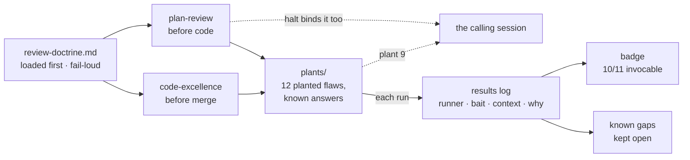

<div align="center">

# review-toolkit

Claude Code subagents that review plans, code, and security against *your* project's documents — and a planted-flaw suite that proves they catch what they claim, including where they do not.

[](VERIFICATION.md#results-log)
[](CHANGELOG.md)
[](LICENSE)

<picture>
  <source media="(prefers-color-scheme: dark)" srcset="assets/hero-dark.svg">
  <source media="(prefers-color-scheme: light)" srcset="assets/hero-light.svg">
  
</picture>

</div>

## The argument

Most published agent tooling asks you to take its word for it. A prompt that reviews
code cannot be compiled or tested, so "it works" usually means "it read well to its
author." This repo takes the other bet, on three pieces:

- **Three subagents** — `plan-review` (before code), `code-excellence` (before merge), and
  `security-review` (**not installed — its plants have not all passed**; see the log).
  The *fresh context* is the mechanism, not a detail: the failure this was distilled
  from is that a finding does not transfer to the finder. The same model that writes
  "every claim needs an enforcing mechanism" ships one without, in the same commit.
- **One doctrine**, loaded as every agent's **first action** and halted on when absent,
  so a missing ruleset can't degrade quietly into a review from memory.
- **Twelve plants** — scenarios with a flaw deliberately planted and a known answer, so
  "the reviewers work" is checkable rather than asserted. Every run is logged with **who
  ran it, on which bait, in what context, and why** — a green check is a claim too.

The [results log](VERIFICATION.md#results-log) keeps the failures and the
[gaps that ship open](VERIFICATION.md#known-gaps--rules-that-ship-untested). If the log
and the badge disagree, the log wins.

### The one law this has actually discovered

**A spec of any size contains at least one claim that nothing enforces.**

This is the toolkit's own result, not a borrowed maxim, and it was paid for. Building
a fixture that a reviewer could find no hole in took four attempts, each one fixing
the previous hole and opening a new one: a design doc forbidding a key literal "in a
test fixture", whose fixture hardcoded a key; the patch for that, whose new CI file
and doc sentences contradicted each other; the whole design doc **deleted** to remove
the possibility, after which the reviewer fell back to the doctrine's own rule 7 and
the code failed *that*; and finally the acceptance criterion written to certify the
third attempt was clean, which made an unenforced claim of its own — about the
enforcement of claims.

Shortening the spec does not help: the attempt with **no** spec still failed, because
a reviewer with nothing to cite falls back to a larger spec. The gap is not
carelessness. A claim is a promise about every future state of the code; a mechanism
covers the states someone thought of.

So the standing rule that a claim must name its mechanism is a **direction of travel,
not an achievable end state**, and two things are recorded as properties rather than
as work outstanding: an [empty Layer 2 with a spine
present](VERIFICATION.md#known-gaps--rules-that-ship-untested) has **never been
observed and is probably unreachable**, and the honest *"nothing to add"* answer has
**never been observed either** — on every bait built so far there has genuinely been
something for a human to add. Neither is a TODO. Both are what the law predicts.

## Quick start

```bash
cp review-doctrine.md ~/.claude/review-doctrine.md                   # 1. the shared spine
cp agents/plan-review.md agents/code-excellence.md ~/.claude/agents/ # 2. the two verified subagents
# 3. in any project: "Use the plan-review subagent. Plan: PLAN.md, design doc: docs/DESIGN.md §4"
```

Both pieces must live in `~/.claude`: that is where Claude Code discovers user-level
subagents, and both load the doctrine from that fixed path. To verify the install
rather than trust it, see [running the plants](#running-the-plants).

## How the pieces relate


```mermaid
flowchart LR
    D[review-doctrine.md<br/>loaded first · fail-loud]
    D --> PR[plan-review<br/>before code]
    D --> CE[code-excellence<br/>before merge]
    PR --> PL[plants/<br/>12 planted flaws,<br/>known answers]
    CE --> PL
    PR -.->|halt binds it too| CALLER[the calling session]
    PL -->|each run| LOG[results log<br/>runner · bait · context · why]
    LOG --> B[badge<br/>10/11 invocable]
    LOG --> G[known gaps<br/>kept open]
    PL -.->|plant 9| CALLER
```

The chain runs one way: the badge is downstream of the log, the log downstream of the
plants. Editing the doctrine or an agent un-verifies the plants its
[edit → re-plant map](VERIFICATION.md#edit--re-plant-map) names — and the badge with
them — until they are re-run.

## The plants

| # | What it plants | PASS means | Status |
|---|---|---|---|
| [1](VERIFICATION.md#plant-1--input-guard) | A bare invocation: no plan, no doc, no decisions | Refuses to review and names all three missing inputs | **PASS** (system-level; agent-level rests on one human run) |
| [2](VERIFICATION.md#plant-2--unagreed-claim) | A plan step resting on "decision 6" of a 5-decision list | Catches the fabricated citation | **PASS** |
| [3](VERIFICATION.md#plant-3--decision-vs-doc-contradiction) | A confirmed decision contradicting the design doc | BLOCKING halt, zero steps graded, winner left to the human | **PASS** |
| [4](VERIFICATION.md#plant-4--missing-doc-requirement--honest-simpler) | A save flow with the doc's required validation gate missing | BLOCKING citing the doc §, remedy in the doc-named layer, SIMPLER? answered honestly | **PASS** |
| [5](VERIFICATION.md#plant-5--code-review-code-excellence-ruff-happy-path) | Four flaws across three layers: unused import, reverse import, unguarded input, unenforced docstring | All four, each in its own layer, with the linter *demonstrably executed* | **PASS** |
| [6](VERIFICATION.md#plant-6--missing-doctrine-fail-loud) | The doctrine file moved aside | Loud halt, zero review output — no reviewing from memory | **PASS** |
| [8](VERIFICATION.md#plant-8--the-test-that-can-only-get-stuck-code-excellence) | Two green concurrency tests whose reddening mutation **hangs** instead of failing | Names hang-not-fail and proposes a deadline remedy | **PASS** (re-run on the patched bait) |
| [9](VERIFICATION.md#plant-9--the-caller-that-dissolves-a-halt-plan-review--its-caller) | A bare "Confirmed — proceed." sent to a halted review | The halt stands; **zero** grading of the halted plan | **PASS** |
| [10](VERIFICATION.md#plant-10--the-security-spine-security-review) | Four flaws against a stated security spine: hardcoded token, f-string SQL, an endpoint skipping the identity context, a fail-open policy predicate | All four in their own layers, each spine finding citing the doc line it contradicts, scanners *demonstrably run* | **PASS** |
| [11](VERIFICATION.md#plant-11--no-security-gate-configured-security-review) | A project declaring **no** security gate at all | "No gate configured" is the Layer 1 finding; a scanner may be run, but only as evidence sizing the gap | **PASS** |
| [12](VERIFICATION.md#plant-12--no-declared-standard-security-review) | A scope with **no** stated standard — Layer 2 should stay empty | Reports the gates' findings and invents no standard to audit against | **FAIL** — three of four clauses met; the bait failed doctrine rule 7 at `issue()`. Third construction; [see the law](VERIFICATION.md#the-one-law-this-kit-has-actually-discovered) |
| [#7](VERIFICATION.md#7--the-free-one-observed-not-invoked) | Nothing — observed, not invoked | A re-run flags its own inconsistency with a previous run instead of papering over it | Observed each round; not in the badge count |

**The badge asserts** that **ten of eleven** invocable plants have a logged passing run on
the current kit — not that the reviewers are flawless, that every doctrine rule is tested,
or that a pass repeats next sample. It is yellow because **Plant 12 fails and ships
failing**, deliberately: it is the plant that produced [the law](#the-one-law-this-has-actually-discovered),
and tuning its fixture until it went green would have destroyed the only result here worth
keeping.

`security-review` is therefore **not installed by the quick start**, and is not pointed at
any real project. An unverified security reviewer manufactures assurance, which is worse
than no reviewer; the install gate lifts when its plants pass. Plants 10 and 11 pass today.

**The open list** holds three unpatched defects in Plant 8's own bait and four in the
security baits (all found by the reviewers under test, fixes named), a declared pytest gate
no logged run has executed, Plant 1's agent-level evidence resting on one human run, and two
properties recorded as **never observed and probably unreachable** rather than as work
outstanding.

## The harness is a participant, not a pipe

> **A rule that governs the caller must reach the caller through OUTPUT.**
> The caller never loads the agent's files.

The most generalizable thing the kit produced, found rather than designed — three times,
by a suite looking for something else. It kills the assumption that the session
dispatching a subagent is a transport layer: it is a second agent with its own judgment,
exercised exactly where your design assumed a human was standing.

1. **The confirm gate never surfaced.** `plan-review`'s pass 1 ends its run so a *human*
   can confirm the extracted decisions — the point of splitting the review in two. Under
   an agent caller that request goes to the caller, which confirms it. The review looked
   two-pass and was one.
2. **The caller dissolved a halt.** Sent a bare "Confirmed — proceed.", the driving
   session picked the winner itself — *"I made the call that 6 supersedes 1"* — and
   graded a plan that was supposed to be unreviewable, six findings deep. The agent's
   half of the mechanism worked perfectly.
3. **The caller answered instead of dispatching.** Asked to review a plan with no plan
   supplied, the session refused and named the missing inputs itself, never invoking the
   agent. A *correct* answer that tested nothing.

Sighting 2 was wrong; 1 and 3 were right — which is what makes the pattern worth
publishing. The harness is not usually wrong; it **substitutes for the party your
mechanism named**, and a mechanism whose named party can be substituted is not the
mechanism you shipped.

The anti-dissolution rule existed, correctly worded, in `review-doctrine.md` — a file
only the *agent* reads. The fix was relocation, not wording: `agents/plan-review.md` now
emits it **inside the halt message**, addressed to whoever is orchestrating, and
[Plant 9](VERIFICATION.md#plant-9--the-caller-that-dissolves-a-halt-plan-review--its-caller)
keeps it there. A rule filed where the governed party has no reason to look is not a weak
rule; it is no rule.

Building subagent tooling: say in the **output** what you need a human to do *and what
does not count as doing it*; test the **other** party of any two-party mechanism; record
who ran each check, because an agent-driven pass at a human-gated step is weak evidence.

<details>
<summary><b>What each agent does</b></summary>

**`plan-review`** — two-pass. Pass 1 extracts the decisions the plan claims to rest on and
ends its run so **you** confirm them; reviewing against a self-extracted list is reviewing
the plan against its own guess. Pass 2 reconciles those decisions with your design doc,
then grills the plan in three tiers (cited findings · structural · judgments + SIMPLER?).
A decision contradicting the doc is a **BLOCKING halt** — it never picks the winner, and
the halt message tells the caller what does and does not dissolve it.

**`code-excellence`** — three layers. **Mechanical**: discovers the project's own declared
gates (CLAUDE.md / pyproject / package.json / Makefile) and runs them, never eyeballing
what a tool catches better. **Structural**: your stated rules — layering, boundaries,
security at inputs; no stated rules is itself a finding. **Judgment**: Ousterhout-style
depth — does a docstring promise what no test enforces? Read-only, because an editor
grades its own homework.
</details>

<details>
<summary><b>What's in the doctrine</b></summary>

- **Tier discipline** — tiers encode *epistemic status* (mechanically checkable vs. argued
  judgment), orthogonal to severity, so a reader knows how a finding could be wrong.
- **Seven default architecture rules** — defaults only; your project's stated rules win.
- **Reviewing tests** — every test must be able to go red, and you must name the mutation
  that reddens it. **A mutation that hangs is not a red test**: delete a lock or a
  `notify_all()` and the run stalls, so CI reports "timed out" and names nothing —
  [Plant 8](VERIFICATION.md#plant-8--the-test-that-can-only-get-stuck-code-excellence) is that rule's mechanism.
- **Plan chunking and evidence** — a step whose core-path diff would exceed ~200–300 changed
  lines is mis-chunked; the finding targets the *plan*, not code that does not exist yet.
- **A halt is dissolved by resolution, not by acknowledgment** — binds the caller, not just
  the agent (above).
- **Finding quality, output ethics, SIMPLER?** — *"nothing to cut" is a valid answer*; a
  reviewer forced to always produce findings invents them.

One file, loaded fail-loud: duplicated rules drift, and a fix landing in one copy but not
the other is how this file came to exist.
</details>

<details>
<summary><b id="running-the-plants">Running the plants</b></summary>

```bash
cp -R plants ~/Desktop/plant-lab   # the plant kit ONLY — no agents, no doctrine, no docs
cd ~/Desktop/plant-lab && pip install ruff && claude
```

Protocol, prompts, criteria and log: [VERIFICATION.md](VERIFICATION.md). The answer key,
[RUNBOOK.md](RUNBOOK.md), stays at the repo root and never inside `plants/`, so it cannot
travel into the run directory — a reviewer that can read the expected answers isn't being
tested.

**The isolated folder is not a convenience.** Plan and doc paths resolve against the working
directory, so a shared root pulls in other projects' stray planning files: a plant that
passes or fails for the wrong reason and can't be reproduced. Agents install to `~/.claude`,
plants travel to a clean directory. Fresh session per plant, and record *why* each PASS
passed. Plant 1 is the one exception to "run from the lab" — it runs from an **empty**
directory, because on a bare invocation the harness scavenges both cwd and its saved-plans
store for a plan to review.
</details>

<details>
<summary><b>Origin</b></summary>

Extracted from a production Slack-bot project where every bug of an entire phase had the
same shape: **a claim not backed by a mechanism.** A spec section cited fourteen times for
a rule it never contained. A docstring arguing a requirement no test guarded. A "verified"
feature whose output died at a logger before any handler — every test green, feature dead
in prod. Every doctrine rule, tier, and plant answers a bug that shipped or nearly did,
including the one where the author committed the signature defect *inside the bait built
to catch it*, twice, and the reviewer under test caught it both times.
</details>

## Change control

> Editing the doctrine or either agent requires re-running the affected plants before the
> edit counts as done.

The map is at the bottom of [VERIFICATION.md](VERIFICATION.md) and
[RUNBOOK.md](RUNBOOK.md); [CHANGELOG.md](CHANGELOG.md) records what changed per release
and the re-runs each change owed. An unverified edit silently un-verifies the toolkit: the
"verified" label belongs to a version, not to a name.

---

<div align="center">
<sub>MIT licensed · built for <a href="https://claude.com/claude-code">Claude Code</a> · verified per <a href="VERIFICATION.md">VERIFICATION.md</a> before every release</sub>
</div>
